# The Levelator
**v2.0.0**
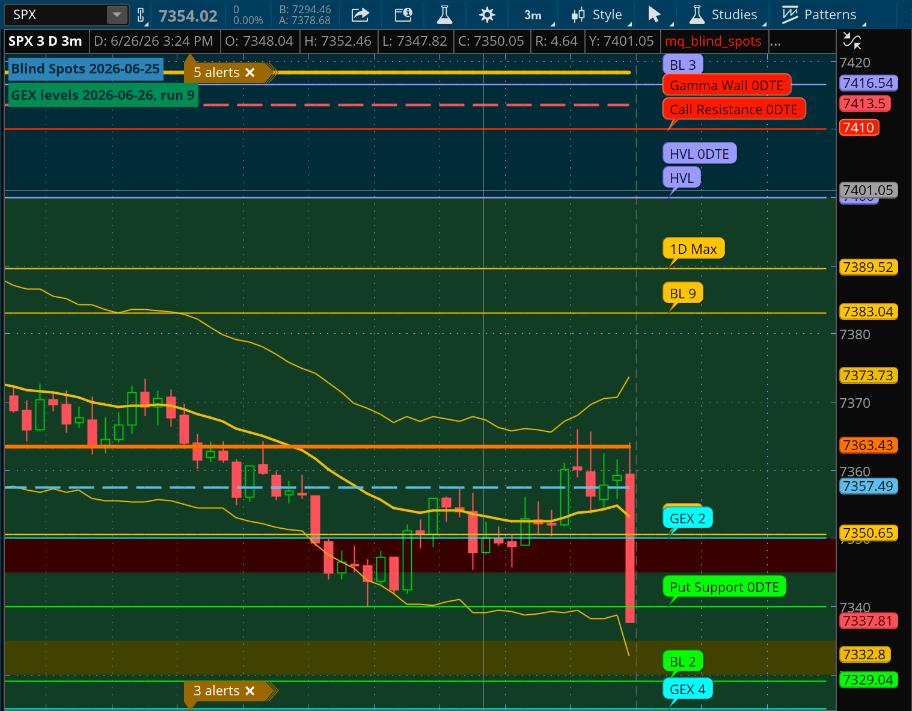
## Description
MenthorQ provides indicators and levels data for use in TradingView.
*The Levelator* generates code for analogous indicators that use the
MenthorQ data to display levels on the *thinkorswim* platform.

Updating the levels is QUICK and EASY. These instructions may appear long, but it's just including precise detail and screen captures. Updating becomes very quick after you've done it a couple of times.

Only two steps are needed to get started:
1. Add two shared indicators to *thinkorswim*
2. Add a bookmarklet to your web browser

### What's a *bookmarklet*?
A bookmarklet is a piece of code that is executed in the web browser,
and appears as any other web site bookmark. *The Levelator*
bookmarklet captures the levels from the MenthorQ web site and
produces the indicator code that displays the levels in thinkorswim.
### What this is: PLEASE READ BEFORE USING
This is a personal side project, with no warranty nor guarantee that it is suitable for use of any kind.

I am not affiliated with MenthorQ beyond being a very satisfied customer. **They may change their web site at any time without warning and break these tools.** I hope I will be able keep this project working as I use it many times daily, but I cannot predict the future.

Nothing here constitutes any form of financial advice as I have no credentials for any of that. Maybe you will find this entertaining, educational, or otherwise useful for some personal purpose I cannot recommend nor predict.

Thank you for reading! Let's get started!
## Adding the thinkorswim indicators
The two indicators are shared similarly to other items you have likely
added to thinkorswim. ("Indicator" is the general term used here.
*thinkorswim* calls these "studies".)

Here are the links to the shared indicators:
- [mq_gex](http://tos.mx/!UrX2Uk61)
- [mq_blind_spots](http://tos.mx/!yPUO1wpP)

Once added to thinkorswim, add the two indicators to a chart where you
wish to have the levels displayed.

See [these instructions](https://www.skool.com/predictableprosperity/classroom/d6a1f4fc?md=c5c0ed0736dc4b38ba8e00be0047ece5) for help adding shared items to thinkorswim, if
you are unfamiliar with that process. Jeff is demonstrating the import of a chart, but it's very similar for these indicators. You just need the first couple of minutes if you have not done this before.
## Adding the bookmarklet
I am using Google Chrome, so all instructions and development are
done on that browser. It should work similarly on other browsers,
though no testing has been performed on browsers other than Google Chrome.

1. Show the bookmarks bar, if it does not already appear. Under the
   *View* menu, choose *Always Show Bookmarks Bar*.
2. Add the bookmarklet to your web browser by dragging the below link to the
bookmarks bar of your browser window:

<a href="javascript:%28function%28%29%7Bconst%20o%3D%222.0.0%22%2Ce%3DString.fromCharCode%2810%29%2Ct%3De%2Be%2Cu%3D%28new%20Date%29.toString%28%29%3Bvar%20i%2Cn%3Ddocument.querySelector%28%22.mb-2%22%29%3F.textContent.trim%28%29%3F%3Fnull%3Breturn%20n%26%26r%28n%29%3Fc%28n%2C%210%29%3A%28navigator.clipboard.readText%28%29.then%28e%3D%3Ei%3Dc%28e%2C%211%29%29.catch%28e%3D%3Ea%28e%29%29%2Ci%29%3Bfunction%20a%28e%29%7Breturn%20console.log%28e%29%2Cwindow.alert%28e%29%2C%211%7Dfunction%20r%28e%29%7Breturn%20e.includes%28%22Call%20Resistance%2C%22%29%7C%7Ce.includes%28%22BL%201%2C%22%29%7Dfunction%20c%28n%2Co%29%7Bconst%20u%3Do%3F%22the%20levels%20found%20on%20the%20page%22%3A%22the%20clipboard%22%2Cf%3D%7B%22Call%20Resistance%22%3A%22LIGHT_RED%22%2C%22Put%20Support%22%3A%22GREEN%22%2CHVL%3A%22VIOLET%22%2C%221D%20Min%22%3A%22ORANGE%22%2C%221D%20Max%22%3A%22ORANGE%22%2C%22Call%20Resistance%200DTE%22%3A%22LIGHT_RED%22%2C%22Put%20Support%200DTE%22%3A%22GREEN%22%2C%22HVL%200DTE%22%3A%22VIOLET%22%2C%22Gamma%20Wall%200DTE%22%3A%22LIGHT_RED%22%2C%22GEX%201%22%3A%22CYAN%22%2C%22GEX%202%22%3A%22CYAN%22%2C%22GEX%203%22%3A%22CYAN%22%2C%22GEX%204%22%3A%22CYAN%22%2C%22GEX%205%22%3A%22CYAN%22%2C%22GEX%206%22%3A%22CYAN%22%2C%22GEX%207%22%3A%22CYAN%22%2C%22GEX%208%22%3A%22CYAN%22%2C%22GEX%209%22%3A%22CYAN%22%2C%22GEX%2010%22%3A%22CYAN%22%2C%22BL%201%22%3A%22LIGHT_RED%22%2C%22BL%202%22%3A%22GREEN%22%2C%22BL%203%22%3A%22VIOLET%22%2C%22BL%204%22%3A%22ORANGE%22%2C%22BL%205%22%3A%22ORANGE%22%2C%22BL%206%22%3A%22LIGHT_RED%22%2C%22BL%207%22%3A%22GREEN%22%2C%22BL%208%22%3A%22VIOLET%22%2C%22BL%209%22%3A%22ORANGE%22%2C%22BL%2010%22%3A%22CYAN%22%7D%3Bvar%20i%2Cc%2Cl%2Cd%2Cp%3Bif%28%21n%7C%7C%21r%28n%29%29return%20a%28%22No%20usable%20text%20found%20on%20the%20web%20page%20nor%20on%20the%20clipboard.%22%2Bt%2B%22Please%20reload%20the%20page%20and%20try%20again.%22%2Bt%2B%22If%20you%20copied%20levels%20to%20the%20clipboard%20manually%2C%20you%20may%20need%20to%20copy%20them%20again%20before%20retrying.%22%29%2C%211%3Bc%3Dn.slice%28n.indexOf%28%22%3A%22%29%2B2%29.replaceAll%28e%2C%22%22%29.split%28%22%2C%20%22%29%2Cd%3Dc%5B0%5D.startsWith%28%22BL%22%29%2Cl%3Ds%28d%2Co%2Cu%29%2Cl%2B%3Dh%28d%2Co%29%2Cl%2B%3D%22def%20bars_in_future%20%3D%203%3B%22%2Be%2B%22def%20show%20%3D%20%21IsNaN%28close%5Bbars_in_future%5D%29%20and%20IsNaN%28close%5Bbars_in_future%20-%201%5D%29%3B%22%2Bt%3Bfor%28i%3D0%3Bi%3Cc.length%3Bi%2B%3D2%29l%2B%3De%2B%22def%20level%22%2Bi%2F2%2B%22%20%3D%20%22%2Bc%5Bi%2B1%5D%2B%22%3B%22%2Be%2B%22plot%20plot%22%2Bi%2F2%2B%22%20%3D%20level%22%2Bi%2F2%2B%22%3B%22%2Be%2B%22plot%22%2Bi%2F2%2B%22.SetDefaultColor%28Color.%22%2Bf%5Bc%5Bi%5D%5D%2B%22%29%3B%22%2Be%2B%22AddChartBubble%28show%2C%20level%22%2Bi%2F2%2B%27%2C%20%22%27%2Bc%5Bi%5D%2B%27%22%2C%20Color.%27%2Bf%5Bc%5Bi%5D%5D%2B%22%29%3B%22%2Be%3Breturn%20l%2B%3Ds%28d%2Co%2Cu%29%2Cm%28l%2Cu%2Cd%2Co%29%7Dfunction%20h%28e%2Cn%29%7Bconst%20s%3D%2270%2C%20130%2C%20180%22%2Co%3D%2246%2C%20139%2C%2087%22%2Ci%3De%3Fs%3Ao%3Bvar%20a%3Dd%28e%2Cn%29%2Cr%3D%27AddLabel%281%2C%20%22%27%2Ba%2B%27%22%2C%20CreateColor%28%27%2Bi%2B%22%29%2C%20Location.TOP_LEFT%2C%20FontSize.SMALL%2C%20yes%29%3B%22%2Bt%3Breturn%20r%7Dfunction%20d%28e%2Ct%29%7Bconst%20s%3Dl%28%29%3Bvar%20n%3De%3F%22Blind%20Spots%20%22%3A%22GEX%20levels%20%22%3Breturn%20n%2B%3Dt%26%26s%3Fs%3A%22%28time%20n%2Fa%29%22%2Cn%2B%3D%22%20%20%22%2Cn%7Dfunction%20s%28t%2Cn%2Cs%29%7Bconst%20i%3DString.fromCharCode%2835%29%2Be%2Cr%3Dt%3F%22Blind%20Spot%22%3A%22GEX%22%2Cd%3Dt%3F%22mq_blind_spots%22%3A%22mq_gex%22%2Cc%3Dl%28%29%3Bvar%20a%3Di%2Bi%2B%22%23%20The%20Levelator%20v%22%2Bo%2Be%2Bi%2B%22%23%20%22%2Br%2B%22%20levels%22%2Be%2Bi%2Bi%2B%22%23%20Data%20retrieved%20for%20the%20%22%2Bd%2B%22%20indicator%20from%20%22%2Bs%2B%22.%22%2Be%2Bi%3Breturn%20n%3Fc%26%26%28a%2B%3D%22%23%20MenthorQ%20%22%2Br%2B%22%20data%20updated%3A%20%22%2Bc%2Be%29%3Aa%2B%3D%22%23%20%28MenthorQ%20update%20timestamp%20unavailable%20from%20clipboard%20levels.%29%22%2Be%2Ca%2B%3Di%2B%22%23%20Script%20last%20generated%20by%20bookmarklet%3A%20%22%2Bu%2Be%2Bi%2Bi%2Ca%7Dfunction%20l%28%29%7Bvar%20e%3Ddocument.querySelector%28%22.container.mx-auto%20.text-base.font-medium%22%29%3F.textContent.trim%28%29%3F%3Fnull%3Breturn%20e%7Dasync%20function%20m%28e%2Ct%2Cn%2Cs%29%7Bvar%20a%3Dn%3F%22steelblue%22%3A%22seagreen%22%2Ci%3D%22%22%3Btry%7Breturn%20await%20navigator.clipboard.writeText%28e%29%2Ci%3D%27%3Ch2%20style%3D%22all%3A%20revert%3B%20margin-bottom%3A%2020px%3B%22%3E%27%2Bd%28n%2Cs%29%2B%27%3C%2Fh2%3E%3Cp%20style%3D%22margin-bottom%3A%2020px%3B%22%3EGenerated%20%3Cspan%20style%3D%22color%3A%20gold%3B%20font-weight%3A%20bold%22%3E%27%2B%28n%3F%22blind%20spot%22%3A%22GEX%22%29%2B%27%3C%2Fspan%3E%20levels%20code%20from%20%3Cspan%20style%3D%22color%3A%20gold%3B%20font-weight%3A%20bold%22%3E%27%2Bt%2B%27%3C%2Fspan%3E.%3C%2Fp%3E%3Cp%20style%3D%22margin-bottom%3A%2030px%3B%22%3EReplace%20the%20entire%20ToS%20%3Cspan%20style%3D%22color%3A%20gold%3B%20font-weight%3A%20bold%22%3E%27%2B%28n%3F%22mq_blind_spots%22%3A%22mq_gex%22%29%2B%27%3C%2Fspan%3E%20indicator%20script%20with%20the%20clipboard%20contents.%3C%2Fp%3E%3Cp%20style%3D%22margin-bottom%3A%2020px%3B%22%3E%3Ca%20style%3D%22color%3A%20mediumblue%3B%22%20target%3D%22_blank%22%20href%3D%22https%3A%2F%2Funfool.github.io%2Ftos-mq%2F%22%3EClick%20here%20for%20full%20instructions%3C%2Fa%3E%3C%2Fp%3E%3Cp%20style%3D%22color%3A%20white%3B%20font-size%3A%2070%25%22%3B%20%22%3EThe%20Levelator%20v%27%2Bo%2B%22%3C%2Fp%3E%22%2Cf%28i%2Ca%29%2C%210%7Dcatch%28e%29%7Breturn%20console.error%28e.message%29%2Cwindow.alert%28%22Please%20reload%20the%20page%20then%20click%20the%20bookmarklet.%22%29%2C%211%7D%7Dasync%20function%20f%28e%2Ct%29%7Bconst%20s%3D%22__sourdough_toast__%22%2Co%3D12e3%3Bdocument.getElementById%28s%29%3F.remove%28%29%3Bconst%20n%3Ddocument.createElement%28%22div%22%29%3Bn.id%3Ds%2Cn.innerHTML%3De%2Cn.onclick%3Dfunction%28%29%7Bdocument.getElementById%28s%29%3F.remove%28%29%7D%2CObject.assign%28n.style%2C%7Bposition%3A%22fixed%22%2Ctop%3A%222%25%22%2Cleft%3A%2230%25%22%2Cbackground%3At%2Ccolor%3A%22white%22%2Cpadding%3A%2210px%2014px%22%2CborderRadius%3A%226px%22%2Cfont%3A%2214px%20system-ui%2C%20sans-serif%22%2CzIndex%3A2147483647%2Copacity%3A0%2Ctransition%3A%22opacity%200.2s%20ease%22%7D%29%2Cdocument.body.appendChild%28n%29%2CrequestAnimationFrame%28%28%29%3D%3E%7Bn.style.opacity%3D1%7D%29%2CsetTimeout%28%28%29%3D%3E%7Bn.style.opacity%3D0%2CsetTimeout%28%28%29%3D%3En.remove%28%29%2C250%29%7D%2Co%29%7D%7D%29%28%29">The Levelator</a>
## Updating the indicators
Use these steps to update each indicator. You should have the chart open
where you want them updated, and you should already have the indicators
added to a chart.

### GEX intraday levels (mq_gex)
GEX intraday level data are updated throughout the trading day by MenthorQ. Use
these steps to update the indicator as often as you wish.

(Note that where CTRL keys are mentioned, these work in both Windows and macOS. You may also use the *command* key instead on macOS, which is generally more convenient.)

1. Navigate to the MenthorQ dashboard.
2. In the navigator on the left, click *Levels*.
   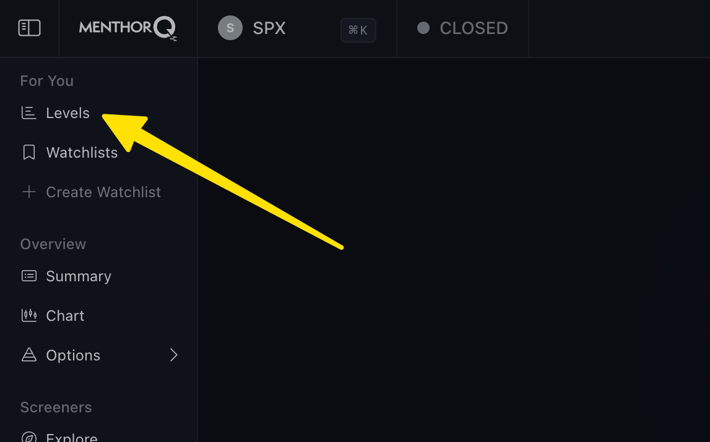
3. Click the *Select Tickers* field, and choose **ONE** ticker only (such as *SPX).
4. Change the *Type* pop-up menu just below, to *Gamma Levels Intraday* (it defaults to Gamma Levels EOD, which is not what we want).
5. Click *Search*.
   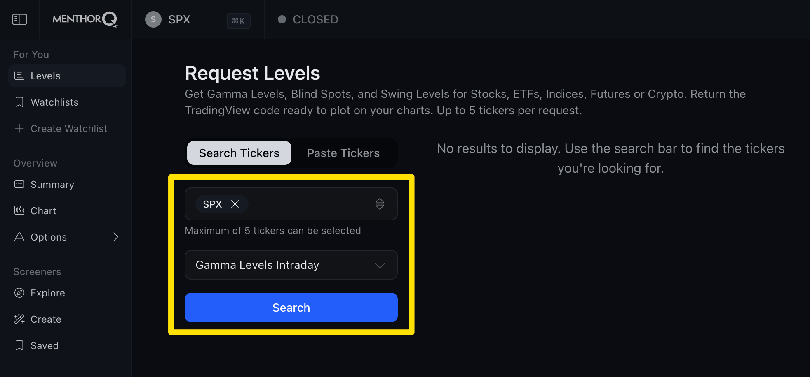
6. After the levels data appear, click *The Levelator* bookmarklet to capture the GEX levels to the clipboard. A green confirmation will be displayed.
   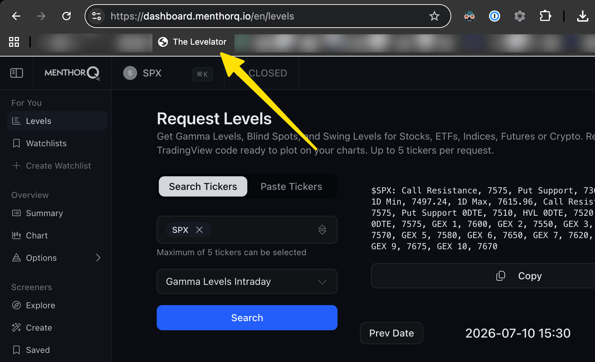
7. In *thinkorswim*, click the *Edit studies* icon in the toolbar. (It
   looks like an Erlenmeyer flask used in a chemistry lab.)
   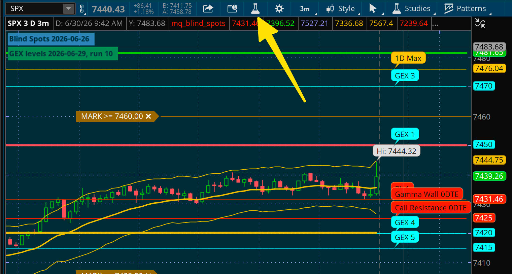
8. Locate the *mq_gex* study in the list, and click the script icon to
   the left of the name.
   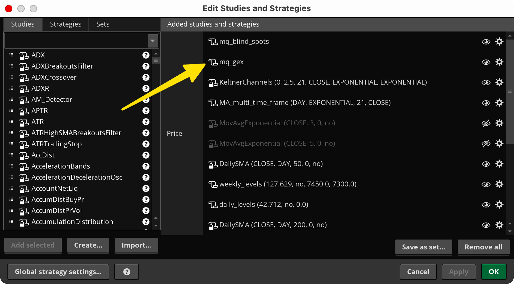
9. Click within the script so you see a cursor.
   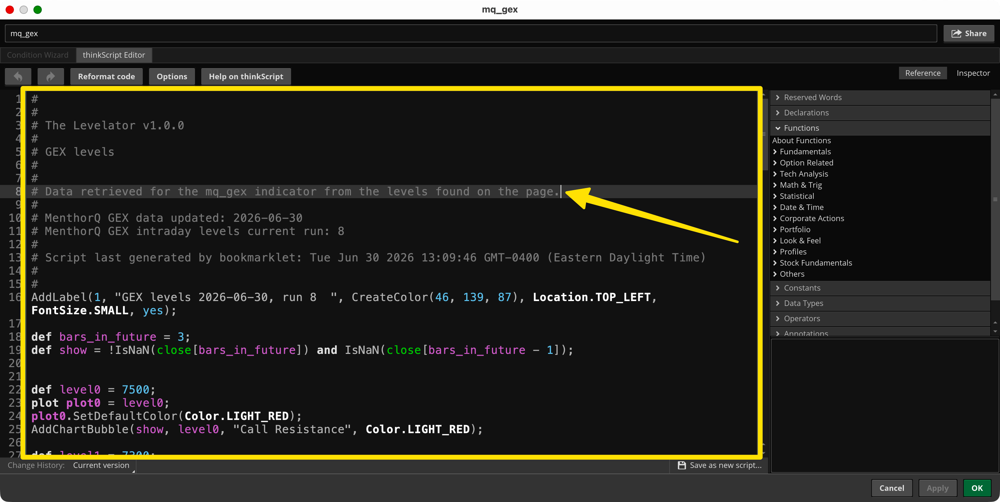
10. Press CTRL-a to select ALL of the script.
   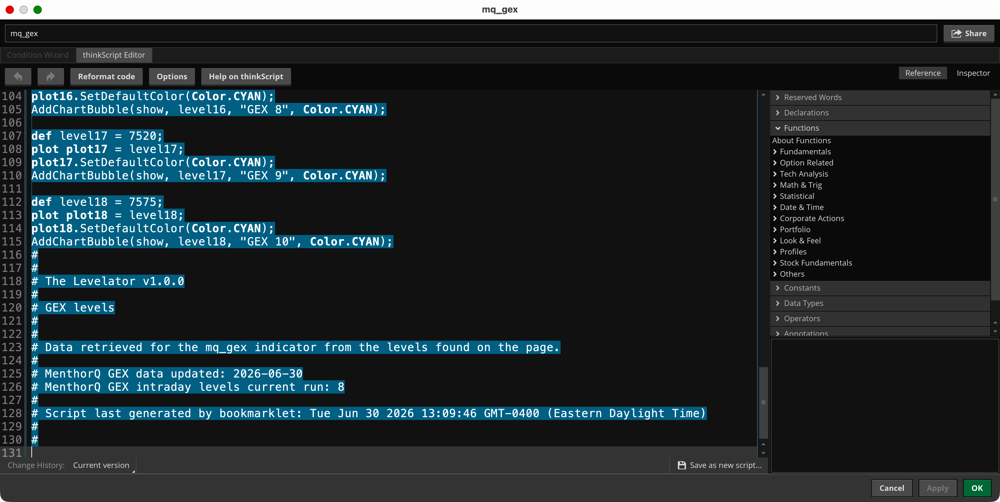
11. With the text selected, press CTRL-v to paste the clipboard contents.
   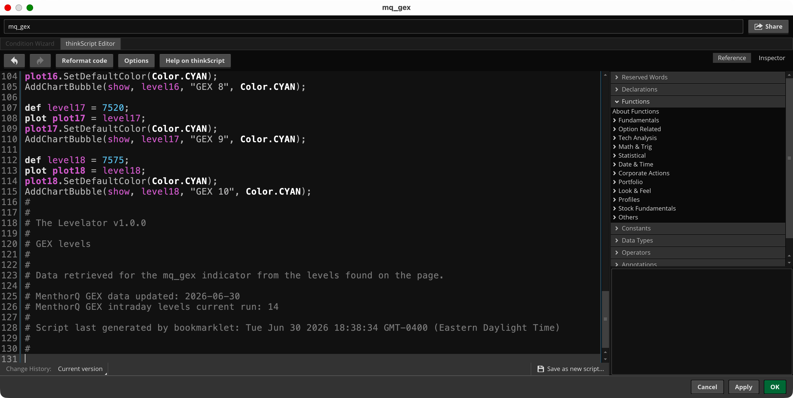
12. Click OK to close the indicator script.
   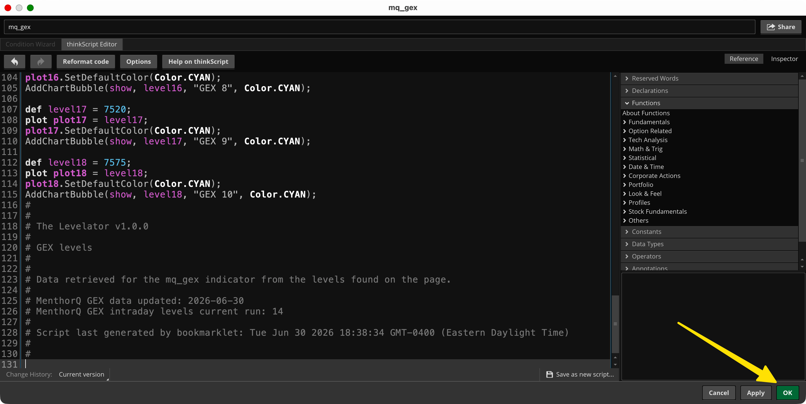
13. Click OK to close the studies window.
	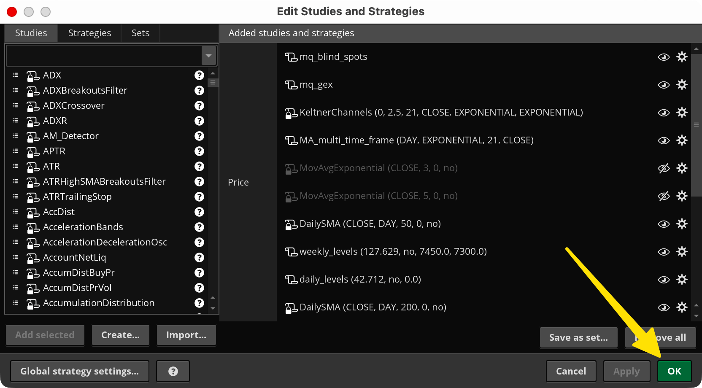

### Blind spots (mq_blind_spots)
Blind spots are updated by MenthorQ **once per day**, after the end of the
trading session. The most recent data will have the date from **the
previous trading session**. You will see this reflected on the datestamp below the data on the MenthorQ dashboard, and on the thinkorswim chart.

This is nearly the exact process as for the intraday levels. Follow the same process as above, with these differences.

- In step 4, choose the *Blindspots* type on the MenthorQ dashboard.
- Confirmation for *The Levelator* is blue.
- In step 8, choose the *mq_blind_spots* study in thinkorswim.
- You need to update the blind spots only once per trading session.
## Other notes
### Efficiently updating intraday levels
After you query the intraday levels, you may leave your browser window open to the Levels page. Each time you want to check for a new update, click the *Search* button again to refresh. (If you reload entire the page, you will need to complete the form again.)

The timestamp at the bottom will show when the data was generated by MenthorQ, and you may compare that with the date indicated on the thinkorswim chart.
### Updating *The Levelator* bookmarklet
The Levelator is viewed as feature-complete. Updates to the bookmarklet are expected to be infrequent, and generally consist of only minor improvements.

If a new version is needed due to breaking changes on the MenthorQ web site, it is easy enough to update.

1. Right-click *The Levelator* in your bookmarks bar, and click *Delete*.
2. Drag the new bookmarklet link from the *Adding the bookmarklet* section above to your bookmarks bar.
3. If you currently have the MenthorQ levels page open, refresh it after adding the new bookmarklet.

The current version number appears at the top of these instructions. Your version appears on the confirmation when using *The Levelator*, and in the actual script pasted to each indicator.

The shared indicators themselves should require no updates.
### The clipboard workaround
*The Levelator*'s automated capture of level data directly from the MenthorQ web site is the intended and quickest method of use. A backup method is provided and useful for some outlier situations, such as:

- The MenthorQ data is not loading on their web site during market peaks. One trader who gets the data loaded may share the raw data with others in a chat.
- The MenthorQ web site has been updated with a breaking change, and *The Levelator* has not yet been updated to automatically capture the level data.

#### Using the clipboard to capture level data
1. Copy the level data manually to your clipboard.
2. Click *The Levelator* bookmarklet.
3. Follow the rest of the instructions above for updating the indicator.

You may get a prompt asking to access the clipboard. The browser is protecting your clipboard from being read without your permission. For *The Levelator* to work, you must allow this clipboard access.

Note that the level data update time is not available when using this method.
